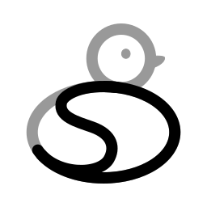

# About SliDesk

{width=250}

A contraction of the words **Slide** and **Desk**, this open-source project aims to be a tool for both slide creation and presentation at conferences.

Write your talk/presentation in Markdown, generate it and visualize it in the web.

SliDesk is a talk engine similar to RevealJS or SliDev, developed with [Bun](https://bun.sh).

## Features

- **Server** with live reload via WebSocket
- **Presentation view** with keyboard, touch, and swipe navigation
- **Speaker view** showing the current and next slide, timer(s), and speech notes
- **File watcher** — if a file is modified, the presentation updates in real time
- **Image management** with responsive sizing and captions
- **Theme system** with CSS custom properties for full visual control
- **Plugin system** to add front-end scripts, back-end routes, and WebSocket handlers
- **Component system** for custom HTML transformations
- **Template system** with named blocks and reusable layouts
- **Internationalisation** with `.lang.json` translation files
- **Presentation generator** (`slidesk create`) to scaffold new talks
- **Telnet server** to present from a terminal
- **Hub** at [slidesk.link](https://slidesk.link) to share and discover addons

## Philosophy

Modular operation is essential. SliDesk must be a lightweight tool, but expandable as needed.

The advantage of using Bun is that it can generate a standalone binary executable that does not need any dependencies.

## Why a new tool?

I decided to create my own tool for my talks because:

- It's fun to create something
- I want a tool that does only the minimum
- I want a very tiny, light tool
- I want it to be permissive — you can embed raw HTML, Vue, React, Svelte, etc. without any problem

## Links

- **Source code**: https://github.com/slidesk/slidesk
- **Hub (plugins, themes, templates, components)**: https://slidesk.link
- **VSCode extension**: https://github.com/slidesk/vscode-sdf-language
