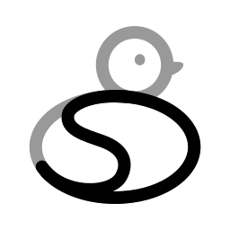

# SliDesk

{width=250}

**Markdown-first slides with native internationalisation and file includes — no Vue project, no build step, no plugin hunting.**

SliDesk is a talk engine that turns Markdown into web-based presentations. If you want the simplicity of Marp with the capabilities of Slidev, but without maintaining a Vue/Vite app to get there, this is what SliDesk is for.

Three things are built in, not bolted on:

- **Native i18n** — one source file, many languages, switched by a single CLI flag
- **File includes** — split a talk across files and directories with `!include()`
- **Zero project scaffolding** — a `.md` file and a single [Bun](https://bun.sh) binary is a working talk

## Prove the i18n in 30 seconds

Give the same talk in French and in English from **one** source file. Three files, no duplication:

=== "main.md"

    ```markdown
    # $$title$$

    ## $$agendaTitle$$

    1. $$partIntro$$
    2. $$partDemo$$
    ```

=== "en.lang.json"

    ```json
    {
      "default": true,
      "translations": {
        "title": "Ship your talk in two languages",
        "agendaTitle": "Agenda",
        "partIntro": "Introduction",
        "partDemo": "Live demo"
      }
    }
    ```

=== "fr.lang.json"

    ```json
    {
      "translations": {
        "title": "Votre talk en deux langues",
        "agendaTitle": "Au programme",
        "partIntro": "Introduction",
        "partDemo": "Démo live"
      }
    }
    ```

Then flip the language with one flag:

```sh
slidesk my-talk        # English — the file marked "default": true
slidesk -l fr my-talk  # French — same slides, same theme, same notes
```

That is the whole feature. No duplicated deck to keep in sync, no per-language branch, no plugin.

!!! tip "It composes with includes"

    Translation happens after includes are resolved, so `$$variables$$` work inside every included
    file. Keep `slides/01-intro.md` language-agnostic and let the `.lang.json` files carry the words.

Details: [internationalisation syntax](reference/syntax/internationalisation), [`--lang` option](reference/options/lang), [includes](reference/syntax/includes).

## Where SliDesk fits

| | Marp | Slidev | SliDesk |
| --- | --- | --- | --- |
| Markdown-first | ✅ | ✅ | ✅ |
| Runtime to learn | — | Vue + Vite | — |
| Multi-language from one source | ✗ | ✗ | ✅ `.lang.json` + `--lang` |
| Slide includes | ✗ | per file, via `src:` frontmatter | ✅ file **or** directory, one line |
| Speaker view with timers & notes | limited | ✅ | ✅ |
| Present from a terminal | ✗ | ✗ | ✅ telnet |

Read the full rationale in [Why SliDesk?](explanation/why-slidesk).

## Features

- **Markdown to slides** — each `##` heading creates a new slide
- **Internationalisation** — multi-language presentations with `.lang.json`
- **Includes** — split a talk across files and directories with `!include()`
- **Live reload** — edit your slides, the browser updates instantly
- **Speaker view** — current + next slide, timer, notes, checkpoints
- **Telnet mode** — present from any terminal via telnet
- **Plugin system** — extend with front-end scripts, back-end routes, WebSocket handlers
- **Templates & themes** — reusable layouts and visual styles
- **Components** — custom `.mjs` modules that transform your slide HTML
- **Hub integration** — share and discover addons at [slidesk.link](https://slidesk.link)
- **Deploy** — export static HTML, or CI/CD for GitHub/GitLab Pages

## Quick start

```sh
# Install via Homebrew (macOS/Linux)
brew tap gouz/tools && brew install slidesk

# Create a new talk
slidesk create my-talk

# Present it
slidesk my-talk

# Open http://localhost:1337
```

See the [installation tutorial](tutorials/01-installation) for other install methods.

## Documentation

- [Tutorials](tutorials) — learn SliDesk step by step
- [How-to Guides](how-to) — solve specific tasks
- [Reference](reference) — commands, options, syntax, APIs
- [Explanation](explanation) — background and architecture
