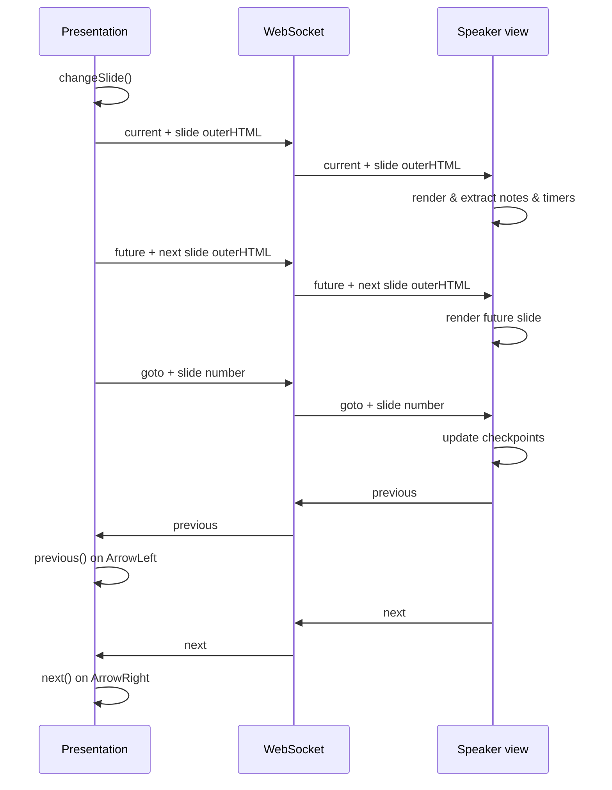

# WebSocket protocol

The presentation view (`index.html`) and speaker/notes view (`notes.html`) synchronise slide state over a real-time connection. The default transport is a **WebSocket** to the server at `/ws`. When running without a server (e.g. `file://` or deployed), the system falls back to a **BroadcastChannel** named `"slidesk_sync"`.

Both transports share the same message format.

## Message format

All messages are JSON:

```json
{
  "action": "<string>",
  "payload": <any>
}
```

`payload` is optional and type depends on the action.

## Actions

### Presentation → Speaker view

These messages originate from the presentation view when the slide changes:

| Action | Payload | Description |
|---|---|---|
| `"current"` | string | Outer HTML of the current `.sd-slide`. The speaker view renders it in `#sd-sv-current` and extracts notes, timer data |
| `"future"` | string | Outer HTML of the next `.sd-slide` (empty string on last slide). Rendered in `#sd-sv-future` |
| `"goto"` | number | Current slide index. Used by the speaker view to look up timer checkpoints |
| `"checkpoints"` | `{timerCheckpoints, nbSlides}` | Timer checkpoint data sent once on page load |

### Speaker view → Presentation

The speaker view sends these actions on keyboard input:

| Action | Payload | Description |
|---|---|---|
| `"next"` | — | Advance to next slide |
| `"previous"` | — | Go back to previous slide |

### Server → Client

The server sends these messages:

| Action | Payload | Description |
|---|---|---|
| `"reload"` | — | Trigger a full page reload (sent when files change) |

### CLI → Server → Client

When interacting via the command line (`slidesk present --goto 5`, `slidesk present --next`, etc.):

| Action | Data | Description |
|---|---|---|
| `"goto"` | number | Jump to a slide |
| `"next"` | — | Next slide |
| `"previous"` | — | Previous slide |

The CLI sends these through `server.send(action, data)`, which publishes `{"action": <action>, "data": <data>}` to the `"slidesk"` channel. The client handles them via `window.slidesk[data.action](data)`.

### Dynamic method dispatch

When the client receives an action it does not recognise, it falls through to:

```js
window.slidesk[data.action](data);
```

This allows any method on `window.slidesk` (e.g. `fullscreen`, `next`, `previous`, `goto`) to be called remotely by setting the `action` to the method name.

### Plugin WebSocket messages

When a plugin defines an `addWS` handler in its `plugin.json`, the server routes messages that include a `plugin` field:

```json
{
  "plugin": "<plugin_name>",
  "message": "..."
}
```

The server calls the plugin's WebSocket handler with the raw JSON string and broadcasts the response as:

```json
{
  "action": "<plugin_name>_response",
  "response": <handler_return_value>
}
```

All clients subscribed to `"slidesk"` receive the response.

### Unrecognised messages

Any message that does not match the built-in actions is **broadcast as-is** to all clients on the `"slidesk"` channel. On the receiving end, if `window.slidesk[data.action]` exists, it is called with `data` as the argument.

## Example flow: slide change



## BroadcastChannel fallback

When `window.location.origin` is `"file://"` or the WebSocket connection fails, the client creates a `BroadcastChannel("slidesk_sync")`. The message format is identical. This enables synchronisation between the presentation and speaker view when both are opened locally from the file system or from a deployed static site.
